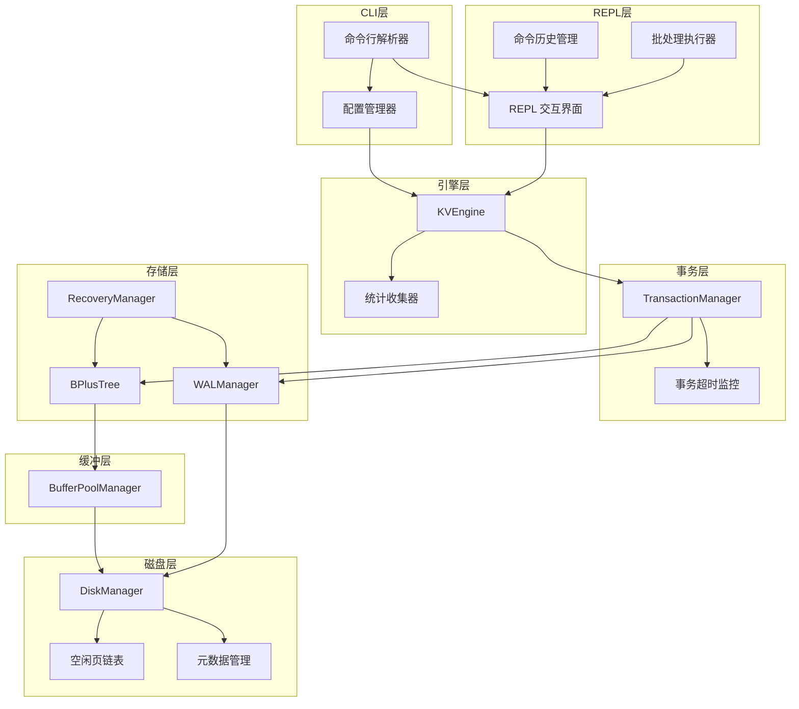
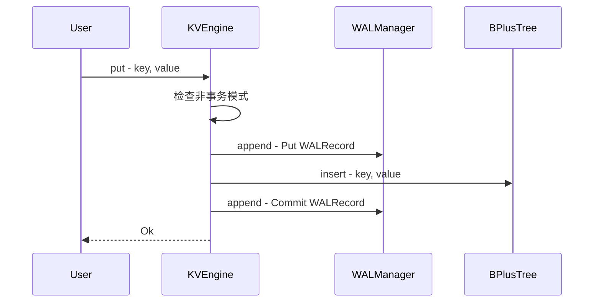
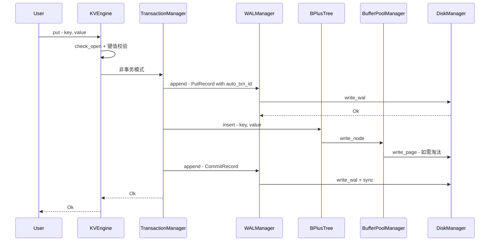
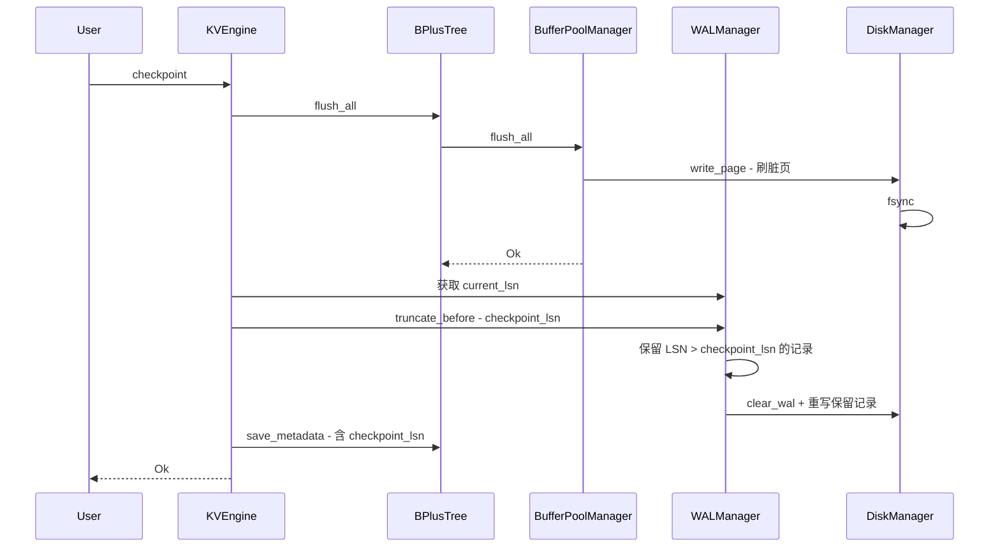
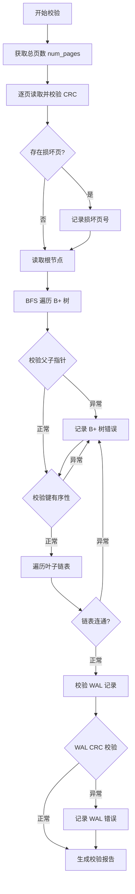

# Key-Value DB 成熟化 — 技术设计文档

> **依赖原则**：遵循需求文档中"零外部依赖（除 tempfile 用于测试）"的约束，本设计所有功能均基于 Rust 标准库实现，不引入新的外部 crate。

## 1. 架构概述

### 1.1 现有架构回顾

当前系统采用分层架构，各层通过所有权链持有下游组件：

```
KVEngine
  └── TransactionManager
        ├── WALManager ──→ DiskManager (WAL 文件)
        └── BPlusTree
              └── BufferPoolManager
                    └── DiskManager (数据文件)
```

**初始化流程**：`DiskManager → BufferPoolManager → BPlusTree → WALManager → RecoveryManager (执行恢复) → TransactionManager`

**关键约束**：
- 单事务模型：同一时刻只允许一个活跃事务
- 非事务写入不经过 WAL，直接操作 B+ 树
- WAL 仅在事务操作时记录
- `close()` 时全量刷写 + 清空 WAL
- 页面大小固定 4KB，B+ 树阶数和缓冲池容量硬编码

### 1.2 设计目标

本次设计的核心目标是在**不破坏现有分层架构**的前提下，通过**扩展各层职责**和**新增独立模块**来实现 25 项功能需求。

### 1.3 整体架构图



### 1.4 新增模块概览

| 新增模块 | 对应源文件 | 职责 |
|---------|-----------|------|
| 配置管理器 | `src/config.rs` | 命令行参数解析、配置文件加载、参数合并 |
| 统计收集器 | 内嵌于 `KVEngine` | 操作计数、缓冲池命中率追踪 |
| 空闲页链表 | 内嵌于 `DiskManager` | 页面分配回收管理 |
| 命令历史管理 | 内嵌于 `Repl` | 历史记录持久化 |
| 批处理执行器 | 内嵌于 `Repl` | 文件命令逐行执行 |

---

## 2. 功能需求设计

### 2.1 数据持久化与可靠性

#### FR-001: 非事务写入的 WAL 记录

**现状分析**：`KVEngine::put()` 和 `KVEngine::delete()` 在非事务模式下直接调用 `btree.insert()` / `btree.remove()`，不经过 WAL。

**设计方案**：

修改 `KVEngine` 的 `put` 和 `delete` 方法，在非事务模式下将每次操作包装为"自动事务"：

1. **自动事务分配**：使用 `TransactionManager` 内部的 `next_txn_id` 分配一个临时事务 ID
2. **WAL 写入流程**：
   - 写入 `WALRecord { op_type: Put/Delete, txn_id: auto_id, ... }`
   - 执行 B+ 树操作
   - 写入 `WALRecord { op_type: Commit, txn_id: auto_id }`
3. **不创建 Transaction 对象**：自动事务不需要快照和回滚能力，仅写入 WAL 记录

**影响的模块**：`kv_engine.rs`、`transaction.rs`

**API 变更**：`KVEngine::put()` 和 `KVEngine::delete()` 内部逻辑变更，公共签名不变

**数据流**：



---

#### FR-002: WAL 检查点机制

**现状分析**：WAL 文件仅在 `close()` 时清空，运行期间无限增长。

**设计方案**：

1. **Checkpoint 元数据**：在 `.meta` 文件中扩展存储内容，新增 `checkpoint_lsn` 字段（8 字节），记录最近一次 checkpoint 对应的 LSN 值
2. **Checkpoint 执行流程**：
   - 调用 `BufferPoolManager::flush_all()` 刷写所有脏页到磁盘
   - 调用 `DiskManager::fsync()` 确保数据落盘
   - 记录当前 LSN 为 `checkpoint_lsn`
   - 将 `checkpoint_lsn` 之后的 WAL 记录保留，之前的 WAL 记录截断
3. **WAL 截断策略**：
   - 新增 `WALManager::truncate_before(lsn)` 方法
   - 读取 WAL 中所有记录，筛选 LSN > checkpoint_lsn 的记录
   - 将筛选后的记录写回 WAL 文件，清除旧内容
4. **恢复阶段适配**：
   - `RecoveryManager` 恢复时从 `.meta` 读取 `checkpoint_lsn`
   - 仅重放 LSN > checkpoint_lsn 的 WAL 记录
5. **触发方式**：
   - API: `KVEngine::checkpoint()`
   - REPL: `checkpoint` 命令

**影响的模块**：`kv_engine.rs`、`wal.rs`、`disk_manager.rs`、`recovery.rs`、`btree.rs`（元数据保存）、`repl.rs`

**API 变更**：
- `KVEngine::checkpoint() -> Result<()>`
- `WALManager::truncate_before(lsn: u64) -> Result<()>`
- `.meta` 文件格式变更：`[root_page_id: 4B][checkpoint_lsn: 8B]`

---

#### FR-003: 数据库文件完整性校验工具

**设计方案**：

1. **校验层次**：

   | 校验项 | 检查内容 |
   |-------|---------|
   | 页面 CRC | 遍历所有已分配页面，读取并校验 CRC32 |
   | 页面结构 | 检查页类型标记合法、键数量与数据区一致 |
   | B+ 树父子指针 | 内部节点的 children 页号对应的子节点，其 parent 指向是否正确 |
   | B+ 树键有序性 | 每个节点内 keys 是否按字节序升序排列 |
   | 叶子链表连通性 | 从最左叶子遍历 next_leaf 链，验证所有叶子节点可达 |
   | WAL 记录 | 逐条读取 WAL 记录，校验 CRC 完整性 |

2. **校验流程**：
   - 通过 `DiskManager` 获取总页数 `num_pages`
   - 逐页读取（绕过缓冲池直接读磁盘），执行 CRC 和结构校验
   - 从根节点开始 BFS/DFS 遍历 B+ 树，校验父子指针和键有序性
   - 遍历叶子链表验证连通性
   - 读取 WAL 文件逐条校验

3. **报告结构**：

```
VerifyReport {
    total_pages: u32,
    corrupted_pages: Vec<u32>,
    btree_errors: Vec<BTreeError>,
    wal_errors: Vec<WALError>,
    passed: bool,
}
```

**影响的模块**：新增校验逻辑，涉及 `kv_engine.rs`、`page.rs`、`btree.rs`、`wal.rs`、`disk_manager.rs`

**API 变更**：`KVEngine::verify() -> Result<VerifyReport>`

---

#### FR-004: 页面空闲回收机制

**现状分析**：`DiskManager::alloc_page()` 中 `next_page_id` 单调递增，删除释放的页号永不复用。

**设计方案**：

1. **空闲页链表（Free List）**：
   - 在 `DiskManager` 中维护一个 `free_list: Vec<u32>` 集合
   - **页面分配**：优先从 `free_list` 取出页号；`free_list` 为空时才递增 `next_page_id`
   - **页面释放**：B+ 树删除节点释放页面时，将页号加入 `free_list`

2. **空闲页标记**：释放的页面在磁盘上写入 `PageType::Free` 标记（0x00），并将数据区清零

3. **持久化**：
   - 将 `free_list` 序列化后追加到 `.meta` 文件末尾
   - 格式：`[free_count: 4B][page_id_0: 4B][page_id_1: 4B]...`
   - 在 `DiskManager::new()` 时从 `.meta` 读取恢复

4. **B+ 树集成**：
   - `BPlusTree` 在节点合并导致页面释放时，调用 `BufferPoolManager` 新增的 `free_page(page_id)` 方法
   - `BufferPoolManager` 转发给 `DiskManager::free_page()`

**影响的模块**：`disk_manager.rs`、`buffer_pool.rs`、`btree.rs`

**API 变更**：
- `DiskManager::free_page(page_id: u32) -> Result<()>`
- `DiskManager::alloc_page()` 内部逻辑变更（优先 free_list）
- `BufferPoolManager::free_page(page_id: u32) -> Result<()>`
- `.meta` 文件格式扩展

---

### 2.2 查询能力增强

#### FR-005: 前缀扫描

**设计方案**：

1. **前缀上界计算**：给定前缀 `prefix`，构造上界 `prefix_upper`：
   - 将 prefix 的最后一个字节 +1（如 `b"user:"` → `b"user;"`）
   - 若最后一个字节为 0xFF，则追加一个 0x00 字节

2. **扫描策略**：调用现有的 `range_scan(prefix, prefix_upper)`，利用 B+ 树的有序性，在前缀结束后自然终止

3. **优化**：在 `BPlusTree` 层新增 `prefix_scan` 方法，在遍历叶子节点时检测当前 key 是否仍以 prefix 开头，一旦不匹配立即停止，避免遍历到 prefix_upper 的边界判断

**影响的模块**：`kv_engine.rs`、`btree.rs`、`repl.rs`

**API 变更**：
- `KVEngine::prefix_scan(prefix: &[u8]) -> Result<Vec<(Vec<u8>, Vec<u8>)>>`
- `BPlusTree::prefix_scan(prefix: &[u8]) -> Vec<(Vec<u8>, Vec<u8>)>`
- REPL 新增 `prefix <prefix>` 命令

---

#### FR-006: 逆序扫描

**现状分析**：当前 B+ 树叶子节点只有 `next_leaf` 指针（指向右兄弟），无法向左遍历。

**设计方案**：

**方案选择**：新增 `prev_leaf` 指针

1. **B+ 树节点扩展**：在 `BPlusTreeNode` 中新增 `prev_leaf: Option<u32>` 字段
2. **序列化扩展**：在节点序列化格式中，`next_leaf` 之后追加 `prev_leaf` 字段（4 字节）
3. **指针维护**：
   - 叶子节点分裂时：右节点的 `prev_leaf` 指向左节点，右节点的 `next_leaf` 继承左节点的原 `next_leaf`
   - 若右节点原有 `next_leaf` 指向的节点，其 `prev_leaf` 更新为右节点
   - 节点合并时反向操作
4. **逆序扫描算法**：
   - 通过 `find_leaf` 找到 end key 所在的叶子节点
   - 从该叶子节点向左（通过 `prev_leaf`）遍历
   - 在每个节点内从右向左收集 key，直到 key < start 为止

**影响的模块**：`btree.rs`、`kv_engine.rs`、`repl.rs`

**API 变更**：
- `KVEngine::scan_reverse(start: &[u8], end: &[u8]) -> Result<Vec<(Vec<u8>, Vec<u8>)>>`
- `BPlusTree::range_scan_reverse(start: &[u8], end: &[u8]) -> Vec<(Vec<u8>, Vec<u8>)>`
- REPL 新增 `rscan <start> <end>` 命令

---

#### FR-007: 带分页的范围扫描

**设计方案**：

1. **扫描参数扩展**：在 `range_scan` 基础上增加 `limit` 和 `offset` 参数
2. **实现策略**：
   - 正常执行 `range_scan` 的叶子遍历逻辑
   - 在收集结果时：跳过前 `offset` 个匹配项，收集最多 `limit` 个匹配项后立即停止遍历
   - 不需要收集全部结果再切片，节省内存和遍历开销
3. **统一扫描接口**：原有 `scan` 方法等价于 `scan_with_limit(start, end, usize::MAX, 0)`

**影响的模块**：`kv_engine.rs`、`btree.rs`、`repl.rs`

**API 变更**：
- `KVEngine::scan_with_limit(start: &[u8], end: &[u8], limit: usize, offset: usize) -> Result<Vec<(Vec<u8>, Vec<u8>)>>`
- `BPlusTree::range_scan_with_limit(start, end, limit, offset)`
- REPL `scan` 命令扩展：`scan <start> <end> [limit] [offset]`

---

#### FR-008: 键存在性检查

**设计方案**：

1. **实现**：基于 `BPlusTree::search()` 方法，返回 `bool` 而非 `Option<Vec<u8>>`
2. **优化空间**：当前 `search` 方法在找到 key 后仍会 `clone` value 数据。新增 `exists` 方法在叶子节点找到匹配 key 后立即返回 `true`，不读取和返回 value

**影响的模块**：`kv_engine.rs`、`btree.rs`、`repl.rs`

**API 变更**：
- `KVEngine::exists(key: &[u8]) -> Result<bool>`
- `BPlusTree::exists(key: &[u8]) -> bool`
- REPL 新增 `exists <key>` 命令

---

#### FR-009: 键计数统计

**设计方案**：

**方案选择**：遍历叶子节点统计（不维护全局计数器，避免事务回滚时的计数同步问题）

1. **全量计数**：从最左叶子节点开始，沿 `next_leaf` 链遍历所有叶子节点，累加每个节点的 `keys.len()`
2. **范围计数**：类似 `range_scan`，但只计数不收集数据
3. **最左叶子获取**：从根节点出发，沿每个内部节点的 `children[0]` 向下遍历到叶子层

**影响的模块**：`kv_engine.rs`、`btree.rs`、`repl.rs`

**API 变更**：
- `KVEngine::count() -> Result<usize>`
- `KVEngine::count_range(start: &[u8], end: &[u8]) -> Result<usize>`
- `BPlusTree::count_all() -> usize`
- `BPlusTree::count_range(start, end) -> usize`
- REPL 新增 `count` 和 `count <start> <end>` 命令

---

### 2.3 配置管理

#### FR-010: 命令行参数支持

**现状分析**：`main.rs` 中 `db_path` 硬编码为 `"data/kvstore.db"`，`KVEngine::open()` 中缓冲池大小硬编码 `1000`，B+ 树阶数硬编码 `64`。

**设计方案**：

1. **新增配置模块** `src/config.rs`：

   定义 `KvConfig` 结构体：

   | 字段 | 类型 | 默认值 | CLI 参数 |
   |------|------|--------|---------|
   | db_path | String | `"data/kvstore.db"` | `--db-path` |
   | buffer_pool_size | usize | `1000` | `--buffer-pool-size` |
   | btree_order | usize | `64` | `--btree-order` |
   | config_file | Option String | None | `--config` |
   | batch_file | Option String | None | `--file` |
   | stop_on_error | bool | false | `--stop-on-error` |
   | repair_mode | bool | false | `--repair` |

2. **参数解析**：使用 `std::env::args()` 手动解析命令行参数，遍历参数列表匹配 `--key value` 模式，支持 `--flag` 形式的布尔开关
3. **KVEngine::open 扩展**：接受 `KvConfig` 参数替代硬编码值
4. **向后兼容**：保留 `KVEngine::open(db_path)` 便利方法，内部使用默认配置

**影响的模块**：新增 `config.rs`，修改 `main.rs`、`kv_engine.rs`

**API 变更**：
- `KVEngine::open_with_config(config: &KvConfig) -> Result<KVEngine>`
- `KvConfig::from_args() -> Result<KvConfig>`

---

#### FR-011: 配置文件支持

**设计方案**：

1. **配置文件格式**：简单的 `key = value` 行格式（使用标准库逐行解析，无需外部依赖）

   配置文件示例：

   ```
   # Key-Value DB 配置文件
   db_path = data/kvstore.db
   buffer_pool_size = 1000
   btree_order = 64
   default_timeout_secs = 0
   ```

   解析规则：
   - 每行格式：`key = value`，等号两侧允许空格
   - `#` 开头的行为注释，跳过
   - 空行跳过
   - value 自动去除首尾空白
   - 数值类型字段自动解析为对应类型

2. **优先级**：默认值 < 配置文件 < 命令行参数
3. **解析流程**：
   - 加载默认值
   - 若指定 `--config`，读取配置文件逐行解析并合并覆盖默认值
   - 命令行参数覆盖配置文件值
4. **错误处理**：配置文件格式错误时报告文件名、行号和错误原因

**影响的模块**：`config.rs`

---

### 2.4 错误处理与用户反馈

#### FR-012: 键值大小限制校验

**现状分析**：页面固定 4KB，节点头部占用 8 字节（page 层）+ 11 字节（B+ 树节点层：1 类型 + 4 父指针 + 2 键数 + 4 next_leaf）。一个叶子节点单个 key-value 对的存储开销为 4(key_len) + key + 4(value_len) + value。

**设计方案**：

1. **最大值计算**：
   - 叶子节点数据区可用空间 = `PAGE_SIZE - DATA_OFFSET(8) - 节点头(11)` = 4077 字节
   - 单个 key-value 对开销 = `4 + key_len + 4 + value_len`
   - 最大 key 长度 = 4069（value 为 0 字节时）
   - 最大 value 长度 = 4069 - key_len
   - 设置保守限制：`MAX_KEY_SIZE = 4060`，`MAX_VALUE_SIZE = 4060`

2. **校验时机**：在 `KVEngine::put()` 入口处，执行任何操作之前校验
3. **校验失败**：返回 `KvError::KeyTooLarge` 或 `KvError::ValueTooLarge`，不执行任何写入

**影响的模块**：`kv_engine.rs`、`error.rs`

**API 变更**：`KvError` 新增 `KeyTooLarge { key_size: usize, max_size: usize }` 和 `ValueTooLarge { value_size: usize, max_size: usize }`

---

#### FR-013: 错误类型扩展与中文错误信息

**设计方案**：

1. **新增错误变体**：

   | 错误变体 | 场景 | 附带上下文 |
   |---------|------|-----------|
   | `KeyTooLarge` | put 时 key 超限 | key_size, max_size |
   | `ValueTooLarge` | put 时 value 超限 | value_size, max_size |
   | `InvalidArgument` | 参数格式/数量错误 | argument 字符串 |
   | `DatabaseVersionMismatch` | 文件版本不兼容 | expected, actual |
   | `TransactionTimeout` | 事务超时自动回滚 | txn_id |
   | `ConfigError` | 配置文件解析错误 | message |
   | `BatchError` | 批处理中出错 | line_number, message |

2. **中文错误信息策略**：
   - `KvError::Display` 保持英文（库级别）
   - 在 `Repl` 层建立错误翻译映射：`KvError → 中文描述`
   - 翻译函数接受 `KvError`，返回包含上下文的中文消息

**影响的模块**：`error.rs`、`repl.rs`

---

#### FR-014: 操作结果反馈增强

**设计方案**：

1. **put 反馈**：
   - `put` 前调用 `exists` 检查 key 是否已存在
   - 新键："OK - 已插入 (key: xxx)"
   - 覆盖："OK - 已更新 (key: xxx)"

2. **delete 反馈**：显示被删除的键名："OK - 已删除 (key: xxx)"

3. **status 增强**：展示以下信息

   | 信息项 | 数据来源 |
   |-------|---------|
   | 数据库路径 | config.db_path |
   | 打开状态 | engine.is_open() |
   | 键总数 | engine.count() |
   | 已使用页数 / 总页数 | disk_manager 统计 |
   | 缓冲池使用率 | buffer_pool 统计 |
   | 当前事务 ID | transaction_manager 统计 |
   | WAL 文件大小 | 磁盘文件元数据 |
   | 数据文件大小 | 磁盘文件元数据 |

4. **scan 反馈**：首行显示扫描范围，末行显示总条数

**影响的模块**：`repl.rs`（主要）、`kv_engine.rs`（需暴露统计接口）

**依赖**：FR-009（count）

---

### 2.5 REPL 与命令行体验

#### FR-015: 命令历史记录

**现状分析**：使用 `std::io::stdin().read_line()` 读取输入，无历史功能。

**设计方案**：

1. **自实现行编辑器**：基于标准库实现基础的历史记录功能（不引入外部 crate）
2. **历史记录管理**：
   - 在 `Repl` 中维护 `history: Vec<String>` 和 `history_index: usize`
   - 历史文件路径：`{db_dir}/.kvdb_history`（与数据库文件同目录）
   - 最大历史条数：1000（可配置）
3. **交互方式**：
   - 上箭头 `↑` / 下箭头 `↓`：浏览历史命令（通过读取终端转义序列 `\x1b[A` / `\x1b[B`）
   - 基本行编辑：Backspace/Delete 通过 `read_line` 内置支持
   - Ctrl+A / Ctrl+E / Ctrl+U 等高级快捷键：依赖终端自身行编辑能力（大多数终端默认支持）
4. **实现策略**：
   - 读取单字符输入检测方向键转义序列（`\x1b[A` = 上, `\x1b[B` = 下）
   - 检测到方向键时，替换当前输入为历史命令
   - 非 `read_line` 模式下使用 `std::io::stdin().read()` 逐字节读取
   - 正常文本输入仍使用 `read_line` 以保持兼容性
5. **历史持久化**：
   - 每次 REPL 启动时从 `.kvdb_history` 文件加载历史
   - 每次执行命令后将命令追加写入历史文件
   - 退出时确保历史已持久化

**影响的模块**：`repl.rs`

---

#### FR-016: 批处理文件执行

**设计方案**：

1. **执行模式**：
   - 交互模式（默认）：从 stdin 读取命令
   - 批处理模式（`--file` 参数）：从文件逐行读取命令执行

2. **批处理流程**：
   - 打开指定文件
   - 逐行读取，跳过空行和 `#` 开头的注释行
   - 对每行执行 `tokenize → execute` 流程
   - 记录成功/失败计数
   - 错误处理策略：
     - 默认：输出错误信息，继续执行
     - `--stop-on-error`：首条错误时停止

3. **执行摘要**：批处理完成后输出 "执行完成: 成功 N 条, 失败 M 条"

4. **架构调整**：
   - 将 `Repl::execute()` 方法独立为公共方法
   - 新增 `Repl::execute_batch(file_path, stop_on_error)` 方法
   - `main.rs` 中判断是否有 `--file` 参数，有则调用批处理，无则进入交互模式

**影响的模块**：`repl.rs`、`main.rs`、`config.rs`

**依赖**：FR-010

---

#### FR-017: 数据导出与导入

**设计方案**：

1. **导出格式**：
   - 文件头部以 `#` 注释标识格式和导出时间
   - 每行一条记录：`key<TAB>value`
   - key 和 value 中的非 UTF-8 安全字符使用 `\xHH` 转义
   - key 和 value 中的 `\` 和 `\t` 字符转义

2. **导出流程**：
   - 调用 `scan("", "\xFF\xFF\xFF\xFF")` 全量扫描
   - 逐条格式化写入文件

3. **导入流程**：
   - 逐行读取文件，跳过注释行和空行
   - 按 `<TAB>` 分割 key 和 value
   - 反转义后调用 `put` 写入数据库

4. **原子性**：导入过程中每条记录独立写入（非事务模式），失败时记录错误行号并继续

**影响的模块**：`kv_engine.rs`、`repl.rs`

**API 变更**：
- `KVEngine::export(file_path: &str) -> Result<usize>`（返回导出条数）
- `KVEngine::import(file_path: &str) -> Result<ImportStats>`
- REPL 新增 `export <file_path>` 和 `import <file_path>` 命令

---

#### FR-018: 优雅退出与数据保护

**现状分析**：`exit` 时直接调用 `engine.close()`，未提交事务的修改会被 `flush_all` 刷写到磁盘。

**设计方案**：

1. **退出检查**：`exit` 命令执行时检查 `engine.in_transaction()`
2. **交互提示**：

   ```
   存在未提交事务，请选择：[C]提交 / [R]回滚 / [Esc]取消
   ```

3. **用户选择处理**：
   - `C/c` → 调用 `engine.commit()` → 关闭
   - `R/r` → 调用 `engine.rollback()` → 关闭
   - 其他输入 → 取消退出，回到 REPL 循环

4. **实现位置**：修改 `Repl::execute()` 中 `exit` 命令的处理逻辑

**影响的模块**：`repl.rs`

---

### 2.6 事务功能增强

#### FR-019: 事务自动回滚（超时机制）

**设计方案**：

1. **超时参数**：
   - `begin` 命令支持可选参数：`begin --timeout 30`（30 秒超时）
   - 无参数 `begin` 不设置超时（保持当前行为）

2. **超时实现**：
   - 在 `Transaction` 结构体中新增 `timeout_at: Option<Instant>` 字段
   - 每次事务操作（put/get/delete）前检查当前时间是否超过 `timeout_at`
   - 超时时自动调用 `rollback()`，返回 `KvError::TransactionTimeout`
   - 不使用后台线程，采用惰性检查策略

3. **配置文件集成**：`[transaction] default_timeout_secs` 配置默认超时时间，0 表示无超时

**影响的模块**：`transaction.rs`、`repl.rs`、`config.rs`

**依赖**：FR-011

---

#### FR-020: 事务内写操作即时 WAL 记录增强

**现状分析**：`TransactionManager::commit()` 调用 `self.btree.flush_all()`，刷写全部脏页。

**设计方案**：

1. **脏页追踪**：在 `Transaction` 结构体中新增 `modified_pages: HashSet<u32>` 字段
2. **记录时机**：事务内每次 `record_operation` 执行 B+ 树操作后，追踪被修改的页面
3. **追踪方式**：
   - `BPlusTree` 的 `write_node` 方法返回被写入的 `page_id`
   - `TransactionManager` 收集这些 page_id 到 `modified_pages`
4. **提交优化**：
   - `commit()` 时仅调用 `flush_page(page_id)` 刷写 `modified_pages` 中的页面
   - 不再调用 `flush_all()`

**影响的模块**：`transaction.rs`、`btree.rs`

---

### 2.7 运维与管理功能

#### FR-021: 数据库空间紧凑化

**设计方案**：

1. **紧凑化流程**：
   - 遍历当前 B+ 树的所有键值对（全量 scan）
   - 在临时文件中创建新的 `DiskManager → BufferPoolManager → BPlusTree` 实例
   - 将所有键值对依次插入新 B+ 树
   - 刷写新数据库文件
   - 替换原数据库文件（原文件重命名为 `.bak`，新文件重命名为原文件名）
   - 删除 `.bak` 文件

2. **统计报告**：

   ```
   CompactionStats {
       original_size: u64,
       compacted_size: u64,
       reclaimed_size: u64,
       pages_before: u32,
       pages_after: u32,
   }
   ```

3. **安全保障**：
   - 紧凑化过程中出错，原数据文件不被破坏（操作在新文件上进行）
   - 仅在最终替换阶段涉及原文件重命名

**影响的模块**：`kv_engine.rs`、`repl.rs`

**依赖**：FR-004（空闲页回收，使紧凑化后文件更小）

**API 变更**：`KVEngine::compact() -> Result<CompactionStats>`

---

#### FR-022: 运行时统计信息

**设计方案**：

1. **统计收集器**：在 `KVEngine` 中新增 `StatsCollector` 结构体

   | 统计项 | 类型 | 说明 |
     |-------|------|------|
   | put_count | u64 | put 操作调用次数 |
   | get_count | u64 | get 操作调用次数 |
   | delete_count | u64 | delete 操作调用次数 |
   | scan_count | u64 | scan 操作调用次数 |
   | buffer_hits | u64 | 缓冲池命中次数 |
   | buffer_misses | u64 | 缓冲池未命中次数 |

2. **数据采集**：
   - 每次 `KVEngine` 操作时递增对应计数器
   - `BufferPoolManager::fetch_page()` 中区分命中/未命中，暴露计数接口

3. **展示命令**：
   - `status`：展示数据库状态 + 基础统计（参见 FR-014）
   - `stats`：展示操作计数
   - `stats reset`：重置所有计数器归零

4. **缓冲池命中率计算**：`hits / (hits + misses)`，在 `status` 展示时计算

**影响的模块**：`kv_engine.rs`、`buffer_pool.rs`、`repl.rs`

**依赖**：FR-009（count）

---

#### FR-023: 数据库重建/修复工具

**设计方案**：

1. **修复模式入口**：`--repair` 命令行参数启动修复模式

2. **修复策略**：

   | 场景 | 修复方法 |
   |------|---------|
   | `.meta` 文件丢失 | 扫描所有页面，识别根节点（不被任何其他节点引用的节点） |
   | 部分页面损坏 | 跳过损坏页面，从 WAL 日志尝试恢复 |
   | WAL 全量重建 | 清空 B+ 树，从 WAL 的已提交事务重放所有操作 |

3. **元数据重建算法**：
   - 读取所有页面，按类型分类（Internal/Leaf/Free）
   - 构建 parent→children 映射
   - 找到没有 parent 的节点即为根节点
   - 重建叶子节点链表（按 key 范围排序）
   - 写入新的 `.meta` 文件

4. **修复日志**：修复过程输出详细信息：跳过的损坏页、恢复的记录数、丢失的数据量

**影响的模块**：新增修复逻辑模块，涉及 `kv_engine.rs`、`disk_manager.rs`、`recovery.rs`

**依赖**：FR-001（非事务 WAL）、FR-003（完整性校验）

---

### 2.8 数据操作便捷性

#### FR-024: 批量操作接口

**设计方案**：

1. **批量写入**：
   - 接受 `Vec<(Vec<u8>, Vec<u8>)>` 参数
   - 内部自动开启事务 → 逐条 put → 提交
   - 任一条失败则回滚整个事务

2. **批量删除**：
   - 接受 `Vec<Vec<u8>>` 参数
   - 内部自动开启事务 → 逐条 delete → 提交
   - 任一条失败则回滚

3. **键值校验**：每条记录在写入前执行 FR-012 的键值大小校验

**影响的模块**：`kv_engine.rs`、`repl.rs`

**API 变更**：
- `KVEngine::batch_put(items: Vec<(Vec<u8>, Vec<u8>)>) -> Result<usize>`
- `KVEngine::batch_delete(keys: Vec<Vec<u8>>) -> Result<usize>`

---

#### FR-025: 键重命名

**设计方案**：

1. **原子操作流程**：
   - 获取旧键的值：`get(old_key)`
   - 若旧键不存在，返回 `KvError::KeyNotFound`
   - 写入新键：`put(new_key, old_value)`
   - 删除旧键：`delete(old_key)`

2. **事务内行为**：
   - 若当前在事务中，重命名作为事务内操作记录 WAL
   - 若非事务模式，作为自动事务执行（依赖 FR-001）

3. **新键已存在时**：覆盖其值（按需求要求）

**影响的模块**：`kv_engine.rs`、`repl.rs`

**API 变更**：
- `KVEngine::rename(old_key: &[u8], new_key: &[u8]) -> Result<()>`
- REPL 新增 `rename <old_key> <new_key>` 命令

---

## 3. 模块交互设计

### 3.1 非事务写入完整流程（FR-001）



### 3.2 Checkpoint 完整流程（FR-002）



### 3.3 完整性校验流程（FR-003）



### 3.4 配置加载优先级（FR-010 + FR-011）


---

## 4. 数据架构

### 4.1 `.meta` 文件格式（扩展）

当前格式：`[root_page_id: 4B]`

扩展后格式：

```
偏移量    长度    字段
0         4B     root_page_id (0xFFFFFFFF = None)
4         8B     checkpoint_lsn (新增, FR-002)
12        4B     free_list_count (新增, FR-004)
16        N*4B   free_list page_ids (新增, FR-004)
```

### 4.2 WAL 记录格式（无变化）

```
LSN: 8B | TxnID: 8B | OpType: 1B | KeyLen: 4B | Key: 变长 | ValueLen: 4B | Value: 变长 | CRC: 4B
```

### 4.3 页面布局（扩展 prev_leaf 字段后）

```
偏移量    长度    字段
0         1B     页类型 (0x00=Free, 0x01=Internal, 0x02=Leaf)
1         4B     CRC32 校验和
5         2B     键数量
7         1B     保留
8         ...    节点数据区
                  节点类型: 1B
                  父指针: 4B
                  键数量: 2B
                  next_leaf: 4B
                  prev_leaf: 4B (新增, FR-006)
                  键值/子节点数据: 变长
```

---

## 5. API 设计规范

### 5.1 KVEngine 公共 API 汇总

| 方法 | 状态 | 对应需求 |
|------|------|---------|
| `open(db_path) -> Result<KVEngine>` | 已有 | — |
| `open_with_config(config) -> Result<KVEngine>` | 新增 | FR-010 |
| `close() -> Result<()>` | 已有 | — |
| `put(key, value) -> Result<()>` | 已有（逻辑变更） | FR-001, FR-012 |
| `get(key) -> Result<Option<Vec<u8>>>` | 已有 | — |
| `delete(key) -> Result<bool>` | 已有（逻辑变更） | FR-001 |
| `scan(start, end) -> Result<Vec<...>>` | 已有 | — |
| `scan_with_limit(start, end, limit, offset) -> Result<Vec<...>>` | 新增 | FR-007 |
| `scan_reverse(start, end) -> Result<Vec<...>>` | 新增 | FR-006 |
| `prefix_scan(prefix) -> Result<Vec<...>>` | 新增 | FR-005 |
| `exists(key) -> Result<bool>` | 新增 | FR-008 |
| `count() -> Result<usize>` | 新增 | FR-009 |
| `count_range(start, end) -> Result<usize>` | 新增 | FR-009 |
| `begin() -> Result<u64>` | 已有 | — |
| `commit() -> Result<()>` | 已有 | — |
| `rollback() -> Result<()>` | 已有 | — |
| `checkpoint() -> Result<()>` | 新增 | FR-002 |
| `verify() -> Result<VerifyReport>` | 新增 | FR-003 |
| `compact() -> Result<CompactionStats>` | 新增 | FR-021 |
| `export(file_path) -> Result<usize>` | 新增 | FR-017 |
| `import(file_path) -> Result<ImportStats>` | 新增 | FR-017 |
| `batch_put(items) -> Result<usize>` | 新增 | FR-024 |
| `batch_delete(keys) -> Result<usize>` | 新增 | FR-024 |
| `rename(old_key, new_key) -> Result<()>` | 新增 | FR-025 |
| `get_stats() -> &StatsCollector` | 新增 | FR-022 |
| `reset_stats() -> ()` | 新增 | FR-022 |

### 5.2 REPL 命令汇总

| 命令 | 别名 | 参数 | 对应需求 |
|------|------|------|---------|
| `put` | set, insert | key value | — |
| `get` | query | key | — |
| `delete` | del, rm | key | — |
| `scan` | range | start end [limit] [offset] | FR-007 |
| `rscan` | — | start end | FR-006 |
| `prefix` | — | prefix | FR-005 |
| `exists` | — | key | FR-008 |
| `count` | — | [start end] | FR-009 |
| `begin` | txn | [--timeout N] | FR-019 |
| `commit` | — | — | — |
| `rollback` | abort | — | — |
| `checkpoint` | — | — | FR-002 |
| `verify` | — | — | FR-003 |
| `compact` | — | — | FR-021 |
| `export` | — | file_path | FR-017 |
| `import` | — | file_path | FR-017 |
| `rename` | ren | old_key new_key | FR-025 |
| `load` | — | file_path | FR-024 |
| `status` | info | — | FR-014, FR-022 |
| `stats` | — | [reset] | FR-022 |
| `help` | ? | — | — |
| `exit` | quit, q | — | FR-018 |

### 5.3 命令行参数汇总

| 参数 | 类型 | 默认值 | 说明 |
|------|------|--------|------|
| `--db-path` | String | data/kvstore.db | 数据库文件路径 |
| `--buffer-pool-size` | usize | 1000 | 缓冲池容量 |
| `--btree-order` | usize | 64 | B+ 树阶数 |
| `--config` | String | None | 配置文件路径 |
| `--file` | String | None | 批处理文件路径 |
| `--stop-on-error` | flag | false | 批处理遇错停止 |
| `--repair` | flag | false | 修复模式 |
| `--help` | flag | — | 显示帮助 |

---

## 6. 设计决策与理由

| 决策 | 选择 | 理由 |
|------|------|------|
| 非事务 WAL 方案 | 自动事务包装 | 复用现有 WAL 基础设施，最小化改动量 |
| 逆序扫描方案 | 新增 prev_leaf 指针 | 避免先正向遍历再反转的内存开销，支持真正的逆序流式扫描 |
| 键计数方案 | 遍历叶子节点统计 | 避免维护全局计数器与事务回滚的同步复杂性 |
| 事务超时方案 | 惰性检查（非后台线程） | 保持单线程模型简洁性，避免引入并发复杂度 |
| 命令行解析 | 手动解析 std::env::args | 遵循零外部依赖原则，参数结构简单无需引入外部库 |
| 行编辑方案 | 基于标准库自实现 | 遵循零外部依赖原则，通过终端转义序列实现基础历史浏览 |
| 配置文件格式 | 简单 key=value 行格式 | 遵循零外部依赖原则，使用标准库逐行解析即可满足需求 |
| 紧凑化方案 | 新建文件 → 替换 | 确保出错时原数据不被破坏 |
| 脏页追踪方案 | HashSet 收集修改页号 | 精确追踪，避免 flush_all 的全量刷写开销 |
| 空闲页持久化 | 追加到 .meta 文件 | 复用现有元数据文件，减少文件管理复杂度 |

---

## 7. 需求覆盖矩阵

| 需求ID | 需求名称 | 设计章节 | 状态 |
|--------|---------|---------|------|
| FR-001 | 非事务写入的 WAL 记录 | 2.1 | ✅ 已覆盖 |
| FR-002 | WAL 检查点机制 | 2.1 | ✅ 已覆盖 |
| FR-003 | 数据库文件完整性校验 | 2.1 | ✅ 已覆盖 |
| FR-004 | 页面空闲回收机制 | 2.1 | ✅ 已覆盖 |
| FR-005 | 前缀扫描 | 2.2 | ✅ 已覆盖 |
| FR-006 | 逆序扫描 | 2.2 | ✅ 已覆盖 |
| FR-007 | 带分页的范围扫描 | 2.2 | ✅ 已覆盖 |
| FR-008 | 键存在性检查 | 2.2 | ✅ 已覆盖 |
| FR-009 | 键计数统计 | 2.2 | ✅ 已覆盖 |
| FR-010 | 命令行参数支持 | 2.3 | ✅ 已覆盖 |
| FR-011 | 配置文件支持 | 2.3 | ✅ 已覆盖 |
| FR-012 | 键值大小限制校验 | 2.4 | ✅ 已覆盖 |
| FR-013 | 错误类型扩展与中文错误信息 | 2.4 | ✅ 已覆盖 |
| FR-014 | 操作结果反馈增强 | 2.4 | ✅ 已覆盖 |
| FR-015 | 命令历史记录 | 2.5 | ✅ 已覆盖 |
| FR-016 | 批处理文件执行 | 2.5 | ✅ 已覆盖 |
| FR-017 | 数据导出与导入 | 2.5 | ✅ 已覆盖 |
| FR-018 | 优雅退出与数据保护 | 2.5 | ✅ 已覆盖 |
| FR-019 | 事务自动回滚 | 2.6 | ✅ 已覆盖 |
| FR-020 | 事务脏页追踪 | 2.6 | ✅ 已覆盖 |
| FR-021 | 数据库空间紧凑化 | 2.7 | ✅ 已覆盖 |
| FR-022 | 运行时统计信息 | 2.7 | ✅ 已覆盖 |
| FR-023 | 数据库重建/修复工具 | 2.7 | ✅ 已覆盖 |
| FR-024 | 批量操作接口 | 2.8 | ✅ 已覆盖 |
| FR-025 | 键重命名 | 2.8 | ✅ 已覆盖 |
