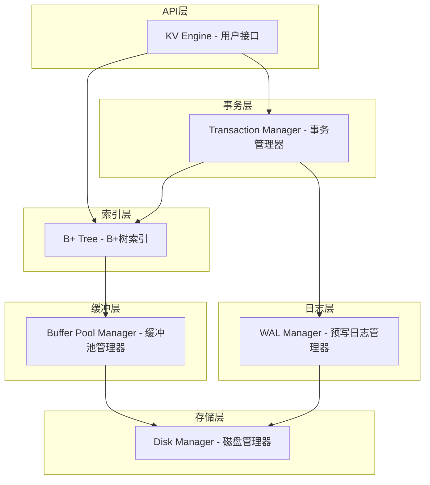
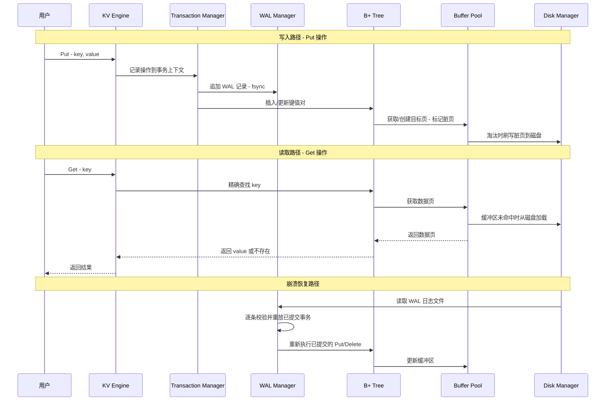
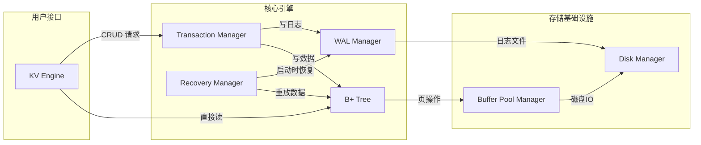

# Design: KV-001 轻量级 Key-Value 存储引擎

> 基于 requirements.md 与 specs.md 进行系统架构与详细设计。

---

## 1. 架构概览

### 1.1 架构目标

- **可扩展性**: 模块化分层设计，每个组件（存储层、索引层、事务层、日志层）职责明确，可独立替换或扩展
- **可维护性**: 单线程模型消除了并发复杂度，各模块通过清晰接口交互，便于理解与调试
- **数据安全性**: 通过 WAL 预写日志与 CRC 校验，保证崩溃后的数据可恢复性

### 1.2 整体架构图



### 1.3 架构分层

系统采用 **自顶向下的六层架构**，上层依赖下层提供的服务：

| 层级 | 名称 | 职责 | 对应模块 |
|------|------|------|----------|
| L1 | API 层 | 对外暴露 Put / Get / Delete / Scan 接口 | KV Engine |
| L2 | 事务层 | 管理 Begin / Commit / Rollback，协调 WAL 与索引 | Transaction Manager |
| L3 | 日志层 | WAL 日志追加写入、校验、重放 | WAL Manager |
| L4 | 索引层 | B+树查找、插入、删除、范围扫描 | B+ Tree |
| L5 | 缓冲层 | 内存缓冲区管理，脏页刷写，LRU 淘汰 | Buffer Pool Manager |
| L6 | 存储层 | 磁盘文件的创建、读写、页分配 | Disk Manager |

### 1.4 核心数据流



---

## 2. 模块划分

### 2.1 模块总览

| 模块名 | 对应需求 | 职责 | 关键接口 |
|--------|----------|------|----------|
| KV Engine | S-04 | 用户操作入口，组装 CRUD 流程 | put, get, delete, scan |
| Disk Manager | S-02 | 管理磁盘文件，按页读写，分配新页 | read_page, write_page, alloc_page |
| Buffer Pool Manager | S-01 | 内存缓冲区管理，LRU 淘汰，脏页刷写 | fetch_page, flush_page, evict |
| B+ Tree | S-03, S-05 | B+树索引，支持查找、插入、删除、范围扫描 | search, insert, remove, range_scan |
| Transaction Manager | S-06 | 事务生命周期管理，原子性提交与回滚 | begin, commit, rollback |
| WAL Manager | S-07 | WAL 日志追加写入、校验、持久化 | append_record, sync, recover |
| Recovery Manager | S-08 | 崩溃恢复，WAL 重放 | recover_from_wal |
| Page | S-02 | 数据页封装，序列化与校验 | serialize, deserialize, compute_crc |

### 2.2 模块交互关系



### 2.3 各模块详细职责

#### 2.3.1 KV Engine（S-04 单键 CRUD）

系统最上层的用户接口模块，负责接收用户操作并协调各子系统完成请求。

**职责：**
- 对外暴露 `put(key, value)`、`get(key)`、`delete(key)`、`scan(start, end)` 四个核心接口
- 判断当前是否处于事务中，若是则将操作委托给事务管理器
- 读取操作直接委托给 B+树索引

#### 2.3.2 Disk Manager（S-02 文件持久化存储）

最底层的存储模块，负责磁盘文件的物理管理。

**职责：**
- 管理数据文件（`.db`）和 WAL 文件（`.wal`）的创建与打开
- 以 4KB 页为单位进行磁盘读写
- 维护页分配计数器，支持分配新页
- 调用 `fsync` 确保数据落盘

#### 2.3.3 Buffer Pool Manager（S-01 内存缓冲区管理）

内存与磁盘之间的缓存层，减少磁盘 IO 次数。

**职责：**
- 维护固定大小的内存缓冲区（HashMap + LRU 链表）
- 读操作优先从缓冲区获取数据页，未命中时从磁盘加载
- 写操作标记脏页，按策略刷写到磁盘
- 缓冲区满时按 LRU 策略淘汰，脏页先刷写再淘汰
- 每个缓冲页包含页号、数据、脏标记

#### 2.3.4 B+ Tree（S-03 B+树索引, S-05 范围扫描）

核心索引模块，维护所有 Key 的有序组织。

**职责：**
- 支持精确查找（O(log n)）
- 支持范围扫描（利用叶子节点兄弟指针）
- 插入时节点满则分裂（叶子节点分裂与内部节点分裂）
- 删除时节点下溢则借用或合并
- 节点存储在 Page 中，通过 Buffer Pool Manager 访问

#### 2.3.5 Transaction Manager（S-06 事务管理）

事务生命周期管理模块，保证 ACID 特性。

**职责：**
- 维护当前事务状态（Active / Committed / Rolledback）
- `begin()`：创建事务上下文，记录事务 ID
- `commit()`：写入 Commit 标记到 WAL，刷写脏页，持久化数据
- `rollback()`：丢弃事务内所有修改，恢复到事务开始前的状态
- 支持事务内读取自身未提交的修改（本地读一致性）
- 不支持嵌套事务，同一时刻最多一个活跃事务

#### 2.3.6 WAL Manager（S-07 预写日志）

预写日志模块，保证修改操作的持久性与崩溃恢复能力。

**职责：**
- 以追加写入（Append-Only）方式记录每条操作
- 每条记录包含 LSN、操作类型、Key、Value、事务 ID、CRC 校验和
- 写入后调用 `fsync` 确保日志落盘
- 提供日志读取接口供恢复模块使用
- 正常关闭时可清空或归档 WAL 文件

#### 2.3.7 Recovery Manager（S-08 崩溃恢复）

启动时的崩溃恢复模块，基于 WAL 日志重放。

**职责：**
- 启动时检测 WAL 文件是否存在未归档的记录
- 逐条读取并校验 WAL 记录（CRC 校验）
- 重放所有已提交事务的操作（Redo）
- 忽略未提交事务的操作
- 遇到损坏记录时停止重放，保留已重放的有效数据

---

## 3. 数据模型

### 3.1 核心数据结构

#### 3.1.1 Page（数据页）

| 字段 | 类型 | 约束 | 说明 |
|------|------|------|------|
| page_id | u32 | 唯一，非空 | 页号，全局唯一标识符 |
| data | [u8; 4096] | 固定 4KB | 页数据区，存储节点序列化后的内容 |
| crc | u32 | 非空 | CRC32 校验和，用于检测数据损坏 |
| is_dirty | bool | 默认 false | 脏标记，标识页是否被修改但未刷写 |

**页内布局（4KB = 4096 字节）：**

| 偏移量 | 长度 | 内容 |
|--------|------|------|
| 0 | 1 字节 | 页类型标记（0x01 = 内部节点，0x02 = 叶子节点，0x00 = 空闲页） |
| 1 | 4 字节 | CRC32 校验和（覆盖偏移 8 到页尾的数据） |
| 5 | 2 字节 | 节点内键数量 |
| 7 | 1 字节 | 保留对齐 |
| 8 | 可变 | 节点数据（键、指针、值等） |

#### 3.1.2 B+TreeNode（B+树节点）

| 字段 | 类型 | 约束 | 说明 |
|------|------|------|------|
| node_type | enum: Internal / Leaf | 非空 | 节点类型 |
| page_id | u32 | 唯一 | 所在页号 |
| keys | Vec\<Vec\<u8\>\> | 有序，非空（根节点可为空） | 键列表，按字节序升序排列 |
| children | Vec\<u32\> | 仅内部节点 | 子节点页号列表，长度 = keys.len() + 1 |
| values | Vec\<Vec\<u8\>\> | 仅叶子节点 | 值列表，与 keys 一一对应 |
| next_leaf | Option\<u32\> | 仅叶子节点 | 右兄弟叶子节点页号，用于范围扫描 |
| parent | Option\<u32\> | 根节点为 None | 父节点页号 |

**内部节点与叶子节点的区别：**

| 属性 | 内部节点 | 叶子节点 |
|------|----------|----------|
| 存储 | 键 + 子节点指针 | 键 + 值 |
| children | 有（子页号） | 无 |
| values | 无 | 有 |
| next_leaf | 无 | 有（兄弟指针） |
| 最小键数 | ⌈order/2⌉ - 1 | ⌈order/2⌉ - 1 |
| 最大键数 | order - 1 | order - 1 |

#### 3.1.3 WALRecord（WAL 日志记录）

| 字段 | 类型 | 约束 | 说明 |
|------|------|------|------|
| lsn | u64 | 唯一，单调递增 | 日志序列号，全局递增 |
| txn_id | u64 | 非空 | 所属事务 ID |
| op_type | enum: Put / Delete / Commit / Rollback | 非空 | 操作类型 |
| key | Vec\<u8\> | Put/Delete 时非空 | 操作的 Key |
| value | Option\<Vec\<u8\>\> | Put 时有值 | 操作的 Value |
| crc | u32 | 非空 | CRC32 校验和，覆盖本记录除 crc 外所有字段 |

**WAL 记录的二进制布局：**

| 偏移量 | 长度 | 内容 |
|--------|------|------|
| 0 | 8 字节 | LSN |
| 8 | 8 字节 | 事务 ID |
| 16 | 1 字节 | 操作类型（0x01=Put, 0x02=Delete, 0x03=Commit, 0x04=Rollback） |
| 17 | 4 字节 | Key 长度 |
| 21 | 可变 | Key 数据 |
| 21+key_len | 4 字节 | Value 长度（Option: 0xFFFFFFFF 表示 None） |
| 25+key_len | 可变 | Value 数据 |
| 尾部 | 4 字节 | CRC32 校验和 |

#### 3.1.4 Transaction（事务上下文）

| 字段 | 类型 | 约束 | 说明 |
|------|------|------|------|
| txn_id | u64 | 唯一 | 事务 ID，全局递增 |
| state | enum: Active / Committed / Rolledback | 非空 | 事务当前状态 |
| operations | Vec\<WALRecord\> | 可为空 | 事务内已执行的操作列表，用于回滚 |
| snapshot | HashMap\<Vec\<u8\>, Option\<Vec\<u8\>\>\> | 可为空 | 事务开始时受影响 Key 的旧值快照，用于回滚恢复 |

### 3.2 Buffer Pool Frame（缓冲帧）

| 字段 | 类型 | 约束 | 说明 |
|------|------|------|------|
| page_id | u32 | 唯一 | 缓存的页号 |
| data | [u8; 4096] | 非空 | 页数据副本 |
| is_dirty | bool | 默认 false | 是否被修改 |
| pin_count | u32 | ≥ 0 | 引用计数，>0 时不允许淘汰 |
| last_access | u64 | 非空 | 最近访问时间戳，LRU 排序依据 |

### 3.3 KV Engine 状态

| 字段 | 类型 | 约束 | 说明 |
|------|------|------|------|
| buffer_pool | BufferPoolManager | 非空 | 缓冲池管理器实例 |
| btree | BPlusTree | 非空 | B+树索引实例 |
| txn_manager | TransactionManager | 非空 | 事务管理器实例 |
| wal_manager | WALManager | 非空 | WAL 管理器实例 |
| disk_manager | DiskManager | 非空 | 磁盘管理器实例 |
| is_open | bool | 非空 | 数据库是否处于打开状态 |

### 3.4 索引定义

系统使用 B+树作为唯一索引结构，Key 本身即为索引键：

| 索引 | 类型 | 键 | 说明 |
|------|------|----|------|
| Primary Index | B+ Tree | Key（字节序列） | 唯一主索引，所有 CRUD 操作通过此索引定位 |
| WAL LSN Index | 隐含（文件偏移） | LSN | WAL 文件内按偏移量顺序访问 |

---

## 4. 技术选型

| 技术领域 | 选型 | 选择理由 |
|----------|------|----------|
| 编程语言 | Rust | 内存安全（所有权系统消除数据竞争）、零成本抽象、适合系统级编程、无 GC 停顿 |
| 存储格式 | 定长页（4KB） | 与操作系统页大小对齐，减少磁盘 IO 次数；简化磁盘管理 |
| 索引结构 | B+ Tree | 适合磁盘存储（节点大小可对齐页大小）、范围扫描高效（叶子节点链表）、查找 O(log n) |
| 缓冲策略 | LRU | 实现简单、适合单线程场景、淘汰策略可预测 |
| 日志策略 | WAL + Append-Only | 追加写入性能高、崩溃恢复简单（Redo 已提交事务）、fsync 保证持久性 |
| 校验算法 | CRC32 | 计算速度快、实现简单、能有效检测磁盘数据损坏 |
| 序列化 | 自定义二进制格式 | 无外部依赖、完全控制布局、减少序列化开销 |
| 键比较 | 字节序比较 | 默认 `Vec<u8>` 逐字节比较，简单且确定性一致 |
| 构建工具 | Cargo | Rust 标准构建工具，零配置依赖管理 |

---

## 5. 设计决策

### 5.1 单线程模型

**决策：** 系统采用单线程设计，不引入任何并发控制机制（无 Mutex、无 MVCC、无锁）。

**理由：**
- 本项目定位为教学型存储引擎，核心目标是理解存储引擎关键路径，而非生产级并发处理
- 消除并发复杂度后，代码更清晰，便于理解 B+树、事务、WAL 的核心逻辑
- 单线程天然保证事务隔离性，无需额外的锁机制或并发控制协议
- 为后续迭代（引入多线程并发）留出扩展空间

### 5.2 B+树而非 LSM-Tree

**决策：** 选择 B+树作为索引结构，而非 LSM-Tree。

**理由：**
- B+树支持原地更新，与事务回滚机制天然兼容（可直接撤销修改）
- B+树读性能稳定（O(log n)），不存在 LSM-Tree 的读放大问题
- B+树节点分裂/合并是数据库教学中的经典算法，学习价值更高
- LSM-Tree 需要后台 Compaction 机制，增加系统复杂度，不符合轻量级定位

### 5.3 固定 4KB 页大小

**决策：** 数据页固定为 4KB（4096 字节）。

**理由：**
- 与操作系统虚拟内存页大小对齐，减少 IO 开销
- 固定大小简化磁盘管理（页偏移 = page_id × 4096）
- B+树节点可设计为单页大小，一个节点恰好占一页
- 4KB 是数据库系统的经典页大小，符合行业惯例

### 5.4 WAL 先写日志策略

**决策：** 所有修改操作必须先写入 WAL 日志（fsync），再应用到主存储。

**理由：**
- WAL 保证已提交事务的持久性：即使崩溃，已提交数据可通过日志重放恢复
- 追加写入（Append-Only）性能优于随机写入，减少磁盘寻道开销
- 崩溃恢复逻辑简单：只需重放已提交事务的日志记录
- WAL 机制是工业级数据库（如 PostgreSQL、MySQL InnoDB）的标准做法

### 5.5 事务回滚基于快照

**决策：** 事务开启时记录受影响 Key 的旧值快照，回滚时恢复快照。

**理由：**
- 单线程环境下，快照方案实现简单，无需 Undo Log 的复杂链式回滚
- 事务内操作数量有限（单线程顺序执行），快照内存开销可控
- 回滚时直接用快照覆盖修改，保证原子性
- 事务提交后快照可释放，不占用长期内存

### 5.6 LRU 缓冲淘汰策略

**决策：** Buffer Pool 采用 LRU（Least Recently Used）淘汰策略。

**理由：**
- LRU 实现简单（HashMap + 双向链表），适合教学场景
- 单线程环境下无需考虑 LRU 的并发安全问题
- 对顺序扫描和热点数据访问模式有良好的缓存命中率
- 相比更复杂的策略（如 LRU-K、ARC），LRU 足以满足本项目需求

### 5.7 自定义二进制序列化

**决策：** 不使用 serde 等序列化框架，采用自定义二进制布局。

**理由：**
- 数据页有固定大小（4KB）约束，需要精确控制序列化后的字节布局
- 减少外部依赖，保持项目轻量
- 页头部信息（类型、CRC、键数量）需要固定偏移量，自定义布局更灵活
- 教学目的需要理解数据在磁盘上的实际存储方式

### 5.8 WAL 损坏时截断恢复

**决策：** 遇到 WAL 记录损坏时，重放损坏点之前的所有有效记录，丢弃损坏点及之后的记录。

**理由：**
- CRC 校验能可靠检测单条记录损坏
- 部分恢复优于完全不可用：最大化保留有效数据
- 损坏点之后的记录无法验证完整性，重放可能导致数据不一致
- 记录错误信息便于人工介入排查

### 5.9 文件组织

**决策：** 数据库使用两个文件：一个数据文件（`.db`）和一个 WAL 文件（`.wal`）。

**理由：**
- 单数据文件简化页管理，页偏移直接通过 `page_id * PAGE_SIZE` 计算
- 独立 WAL 文件便于日志管理和恢复时的顺序读取
- 两文件模型是轻量级数据库的经典设计（如 SQLite）
- 避免多文件管理的复杂性（文件句柄管理、目录维护等）

---

## 6. 模块间接口规范

### 6.1 KV Engine ↔ Transaction Manager

| 方法 | 参数 | 返回值 | 说明 |
|------|------|--------|------|
| begin | 无 | TxnId | 开启事务，返回事务 ID |
| commit | 无 | Result | 提交当前事务 |
| rollback | 无 | Result | 回滚当前事务 |
| in_transaction | 无 | bool | 查询当前是否在事务中 |

### 6.2 KV Engine / Transaction Manager ↔ B+ Tree

| 方法 | 参数 | 返回值 | 说明 |
|------|------|--------|------|
| search | key: &[u8] | Option\<Vec\<u8\>\> | 精确查找 |
| insert | key: &[u8], value: &[u8] | Result | 插入或更新 |
| remove | key: &[u8] | Result\<bool\> | 删除，返回是否成功 |
| range_scan | start: &[u8], end: &[u8] | Vec\<(Vec\<u8\>, Vec\<u8\>)\> | 范围扫描，含边界 |

### 6.3 B+ Tree ↔ Buffer Pool Manager

| 方法 | 参数 | 返回值 | 说明 |
|------|------|--------|------|
| fetch_page | page_id: u32 | Result\<Page\> | 获取数据页，未命中从磁盘加载 |
| create_page | 无 | Result\<(u32, Page)\> | 分配新页并返回页号和页数据 |
| mark_dirty | page_id: u32 | 无 | 标记指定页为脏页 |
| flush_page | page_id: u32 | Result | 将指定脏页刷写到磁盘 |

### 6.4 Transaction Manager ↔ WAL Manager

| 方法 | 参数 | 返回值 | 说明 |
|------|------|--------|------|
| append | record: WALRecord | Result\<u64\> | 追加 WAL 记录并 fsync |
| sync | 无 | Result | 强制 fsync 当前 WAL |

### 6.5 WAL Manager / Recovery Manager ↔ Disk Manager

| 方法 | 参数 | 返回值 | 说明 |
|------|------|--------|------|
| read_page | page_id: u32 | Result\<[u8; 4096]\> | 读取指定页 |
| write_page | page_id: u32, data: &[u8; 4096] | Result | 写入指定页 |
| alloc_page | 无 | Result\<u32\> | 分配新页，返回页号 |
| fsync | 无 | Result | 强制刷写到磁盘 |

---

## 7. 文件组织结构

```
src/
├── main.rs              # 入口，示例用法
├── lib.rs               # 库入口，模块声明
├── disk_manager.rs      # Disk Manager 模块（S-02）
├── buffer_pool.rs       # Buffer Pool Manager 模块（S-01）
├── page.rs              # Page 数据结构与序列化（S-02）
├── btree.rs             # B+ Tree 索引模块（S-03, S-05）
├── kv_engine.rs         # KV Engine 接口模块（S-04）
├── transaction.rs       # Transaction Manager 模块（S-06）
├── wal.rs               # WAL Manager 模块（S-07）
├── recovery.rs          # Recovery Manager 模块（S-08）
└── error.rs             # 统一错误类型定义
```

**磁盘文件：**

```
data/
├── kvstore.db           # 主数据文件（页式存储，4KB 对齐）
└── kvstore.wal          # WAL 预写日志文件（追加写入）
```
