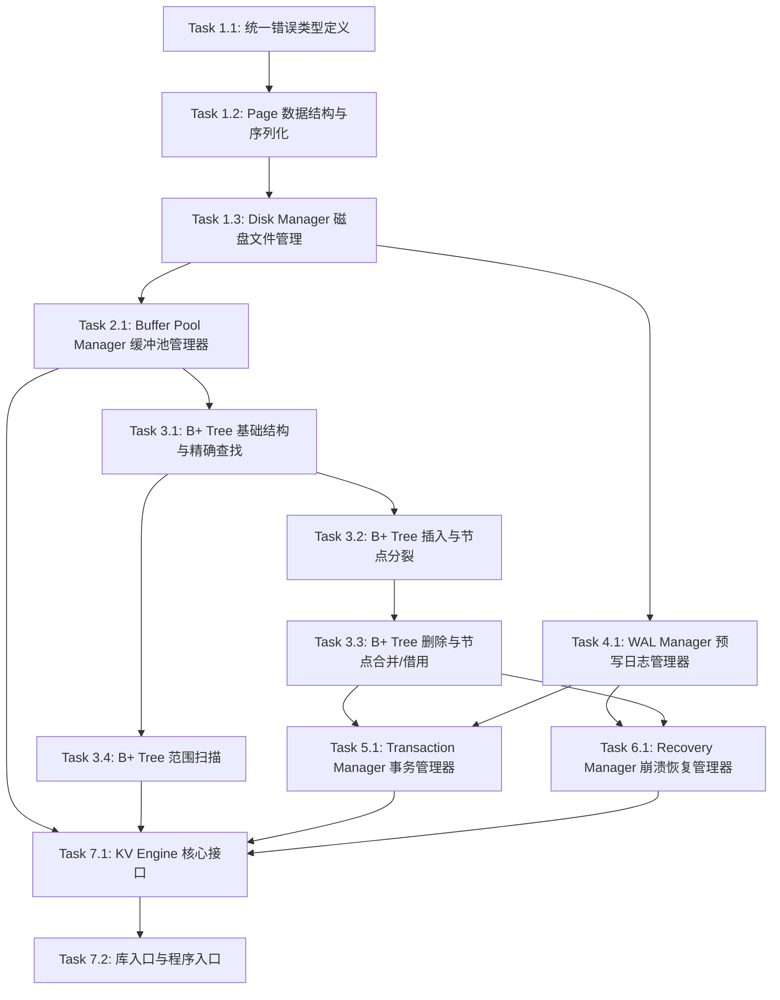

# Tasks: KV-001 轻量级 Key-Value 存储引擎

> 基于 requirements.md、specs.md 与 design.md 进行任务分解。

## Phase 1: 基础设施层

### Task 1.1: 统一错误类型定义
- **输入**: design.md 第 6 节接口规范中定义的各类错误场景
- **输出**: `src/error.rs`
- **关联需求**: R1, R2, R3, R4, R5
- **描述**:
  1. 定义全局统一错误枚举类型 `KvError`，覆盖以下变体：
     - `PageCorrupted { page_id: u32 }` — 数据页 CRC 校验失败
     - `PageNotFound { page_id: u32 }` — 页不存在
     - `KeyNotFound` — 键不存在（非错误场景，用于 Get/Delete 返回指示）
     - `IoError(io::Error)` — 文件 I/O 错误
     - `WalCorrupted { lsn: u64 }` — WAL 记录校验失败
     - `NoActiveTransaction` — 无活跃事务时调用 Commit/Rollback
     - `NestedTransaction` — 嵌套事务不支持
     - `DatabaseClosed` — 数据库已关闭
  2. 为 `KvError` 实现 `std::fmt::Display` 和 `std::error::Error` trait
  3. 实现 `From<std::io::Error>` 转换，支持 `?` 操作符自动转换 I/O 错误
  4. 定义类型别名 `type Result<T> = std::result::Result<T, KvError>`
- **依赖**: 无

### Task 1.2: Page 数据结构与序列化
- **输入**: design.md 第 3.1.1 节 Page 数据模型、页内布局定义（偏移量与字节长度）
- **输出**: `src/page.rs`
- **关联需求**: R1（场景 1: 正常写入数据并从磁盘恢复, 场景 2: 数据页校验失败时的错误处理）
- **描述**:
  1. 定义 `Page` 结构体，包含字段：`page_id: u32`、`data: [u8; 4096]`、`crc: u32`、`is_dirty: bool`
  2. 定义页内布局常量：页类型偏移 0（1 字节）、CRC 偏移 1（4 字节）、键数量偏移 5（2 字节）、保留对齐偏移 7（1 字节）、数据区起始偏移 8
  3. 定义页类型枚举 `PageType`：`Free(0x00)`、`Internal(0x01)`、`Leaf(0x02)`
  4. 实现 `Page::new(page_id: u32)` 创建空白页（数据区全零、类型为 Free）
  5. 实现 `Page::compute_crc()` — 计算偏移 8 至页尾数据的 CRC32 校验和
  6. 实现 `Page::validate_crc()` — 校验存储的 CRC 与计算值一致，失败返回 `KvError::PageCorrupted`
  7. 实现 `Page::serialize()` — 将 Page 结构体写入 `[u8; 4096]` 字节数组（含头部和数据区，最后更新 CRC 字段）
  8. 实现 `Page::deserialize(data: &[u8; 4096])` — 从字节数组解析为 Page 结构体，校验 CRC
  9. 实现 `get_page_type()` / `set_page_type()` 读写页类型标记
  10. 实现 `get_key_count()` / `set_key_count()` 读写键数量字段
- **依赖**: Task 1.1

### Task 1.3: Disk Manager 磁盘文件管理
- **输入**: design.md 第 2.3.2 节 Disk Manager 职责、第 6.5 节接口规范、第 5.9 节文件组织决策
- **输出**: `src/disk_manager.rs`
- **关联需求**: R1（场景 1: 正常写入数据并从磁盘恢复, 场景 5: 多次写入后数据一致性）
- **描述**:
  1. 定义 `DiskManager` 结构体，持有数据文件句柄 `db_file: File`、WAL 文件句柄 `wal_file: File`、页分配计数器 `next_page_id: u32`
  2. 实现 `DiskManager::new(db_path: &str)` — 创建或打开 `.db` 数据文件和 `.wal` 日志文件；根据 `.db` 文件大小计算已有页数，初始化 `next_page_id`
  3. 实现 `read_page(page_id: u32) -> Result<[u8; 4096]>` — 计算文件偏移 `page_id * 4096`，使用 `Seek` + `Read` 精确读取 4KB 数据
  4. 实现 `write_page(page_id: u32, data: &[u8; 4096]) -> Result<()>` — 计算偏移并使用 `Seek` + `Write` 写入 4KB 数据
  5. 实现 `alloc_page() -> Result<u32>` — 返回当前 `next_page_id` 并递增；若文件不足则扩展（写入零填充页）
  6. 实现 `fsync() -> Result<()>` — 调用 `db_file.sync_all()` 和 `wal_file.sync_all()` 确保数据落盘
  7. 实现 `shutdown()` — 执行 fsync 后关闭文件句柄
  8. 处理边界情况：文件不存在时自动创建、读取超出文件大小时的错误处理
- **依赖**: Task 1.1, Task 1.2

## Phase 2: 缓冲层

### Task 2.1: Buffer Pool Manager 缓冲池管理器
- **输入**: design.md 第 2.3.3 节 Buffer Pool Manager 职责、第 3.2 节 Buffer Pool Frame 数据模型、第 6.3 节接口规范、第 5.6 节 LRU 淘汰策略决策
- **输出**: `src/buffer_pool.rs`
- **关联需求**: R1（场景 3: 缓冲区未命中时从磁盘加载, 场景 4: 缓冲区满时淘汰策略, 场景 5: 多次写入后数据一致性）
- **描述**:
  1. 定义 `BufferFrame` 结构体：`page_id: u32`、`data: [u8; 4096]`、`is_dirty: bool`、`pin_count: u32`、`last_access: u64`
  2. 定义 `BufferPoolManager` 结构体，持有 `frames: HashMap<u32, BufferFrame>`、`lru_order: VecDeque<u32>`（双向队列维护 LRU 顺序）、`capacity: usize`、`disk_manager: DiskManager`、全局访问计数器 `access_counter: u64`
  3. 实现 `BufferPoolManager::new(capacity: usize, disk_manager: DiskManager)` — 初始化指定容量的缓冲池
  4. 实现 `fetch_page(page_id: u32) -> Result<Page>` — 优先从 `frames` 中查找；未命中时调用 `DiskManager::read_page` 加载到缓冲区，若缓冲区满则触发淘汰；加载后递增 `pin_count`，更新 `last_access`
  5. 实现 `create_page() -> Result<(u32, Page)>` — 调用 `DiskManager::alloc_page` 分配新页号，创建空白 `BufferFrame` 并加入缓冲区
  6. 实现 `mark_dirty(page_id: u32)` — 设置指定帧的 `is_dirty = true`
  7. 实现 `flush_page(page_id: u32) -> Result<()>` — 若帧为脏页，调用 `DiskManager::write_page` 写入磁盘并调用 `fsync`，清除脏标记
  8. 实现 `flush_all() -> Result<()>` — 遍历所有帧，刷写所有脏页
  9. 实现 `unpin(page_id: u32)` — 递减 `pin_count`，允许该帧被淘汰
  10. 实现 LRU 淘汰逻辑 `evict()` — 从 `lru_order` 尾部查找 `pin_count == 0` 的帧；脏页先调用 `flush_page` 刷写再移除；无可用帧时返回错误
  11. 实现 `shutdown() -> Result<()>` — 调用 `flush_all` 刷写所有脏页，清空缓冲区
- **依赖**: Task 1.2, Task 1.3

## Phase 3: 索引层

### Task 3.1: B+ Tree 基础结构与精确查找
- **输入**: design.md 第 3.1.2 节 B+TreeNode 数据模型、第 2.3.4 节 B+ Tree 职责
- **输出**: `src/btree.rs`
- **关联需求**: R2（场景 1: 精确查找返回正确值, 场景 6: 空树的查找与插入）
- **描述**:
  1. 定义 `NodeType` 枚举：`Internal`、`Leaf`
  2. 定义 `BPlusTreeNode` 结构体：`node_type: NodeType`、`page_id: u32`、`keys: Vec<Vec<u8>>`、`children: Vec<u32>`（内部节点子页号）、`values: Vec<Vec<u8>>`（叶子节点值）、`next_leaf: Option<u32>`（叶子节点兄弟指针）、`parent: Option<u32>`
  3. 定义 `BPlusTree` 结构体：`root_page_id: Option<u32>`、`order: usize`（阶数，可配置）、`buffer_pool: BufferPoolManager`
  4. 实现节点序列化 `BPlusTreeNode::serialize()` — 将节点字段按二进制布局写入 `Page` 数据区（偏移 8 起）
  5. 实现节点反序列化 `BPlusTreeNode::deserialize()` — 从 `Page` 数据区解析为 `BPlusTreeNode`
  6. 实现 `BPlusTree::new(order: usize, buffer_pool: BufferPoolManager)` — 创建空 B+树，`root_page_id = None`
  7. 实现键比较函数 `compare_keys(a: &[u8], b: &[u8]) -> Ordering` — 默认字节序逐字节比较
  8. 实现 `search(key: &[u8]) -> Option<Vec<u8>>` — 空树返回 `None`；否则从根节点递归查找：内部节点二分查找确定子节点页号，叶子节点二分查找匹配 Key
  9. 实现空树处理：`root_page_id` 为 `None` 时 `search` 直接返回 `None`
- **依赖**: Task 2.1

### Task 3.2: B+ Tree 插入与节点分裂
- **输入**: design.md 第 3.1.2 节节点分裂规则、specs.md R2 场景 3 和场景 4
- **输出**: 修改 `src/btree.rs`
- **关联需求**: R2（场景 3: 插入数据触发叶子节点分裂, 场景 4: 连续插入触发根节点分裂）
- **描述**:
  1. 实现 `insert(key: &[u8], value: &[u8]) -> Result<()>` — 空树时调用 `buffer_pool.create_page()` 创建根叶子节点并写入键值对；否则从根递归找到目标叶子节点执行插入
  2. 实现叶子节点插入逻辑：在 `keys` 和 `values` 中按序插入，保持 Key 有序
  3. 实现叶子节点溢出检测：插入后 `keys.len() > order - 1` 时触发分裂
  4. 实现叶子节点分裂：将后半部分 Key-Value 移到新创建的叶子节点，设置 `next_leaf` 兄弟指针，将中间 Key 提升到父节点
  5. 实现内部节点分裂：将后半部分 Key-Children 移到新节点，中间 Key 提升到父节点
  6. 实现根节点分裂：创建新根节点，包含分裂产生的中间 Key 和两个子节点指针，更新 `root_page_id`，树高度增加 1
  7. 实现父节点递归更新：分裂后中间 Key 插入父节点，父节点溢出则递归分裂直至根节点
  8. 分裂后对所有受影响页调用 `buffer_pool.mark_dirty()`
- **依赖**: Task 3.1

### Task 3.3: B+ Tree 删除与节点合并/借用
- **输入**: design.md 第 3.1.2 节节点合并规则、specs.md R2 场景 5
- **输出**: 修改 `src/btree.rs`
- **关联需求**: R2（场景 5: 删除数据触发节点合并或借用）
- **描述**:
  1. 实现 `remove(key: &[u8]) -> Result<bool>` — 从根递归找到目标叶子节点，删除 Key-Value 对；Key 不存在返回 `Ok(false)`
  2. 实现节点下溢检测：删除后 Key 数量低于最小填充阈值 `⌈order/2⌉ - 1`（根节点除外）
  3. 实现兄弟节点借用逻辑：优先尝试从左兄弟借用最大 Key（带父节点 Key 下调），其次从右兄弟借用最小 Key（带父节点 Key 上提）
  4. 实现兄弟节点合并逻辑：借用失败时，将当前节点与兄弟节点合并，从父节点删除对应的分隔 Key，更新 `next_leaf` 兄弟指针
  5. 实现内部节点的递归下溢处理：合并或借用后父节点 Key 数量可能低于阈值，递归向上处理
  6. 实现根节点为空时的树高度缩减：若根内部节点仅剩一个子节点，该子节点成为新根
  7. 合并或借用后对所有受影响页调用 `buffer_pool.mark_dirty()`
- **依赖**: Task 3.2

### Task 3.4: B+ Tree 范围扫描
- **输入**: design.md 第 2.3.4 节范围扫描职责、specs.md R2 场景 2
- **输出**: 修改 `src/btree.rs`
- **关联需求**: R2（场景 2: 范围扫描按序返回结果）, R3（场景 5: 范围扫描 Scan 基本功能, 场景 6: Scan 无匹配结果, 场景 7: 空数据库上的操作）
- **描述**:
  1. 实现 `range_scan(start: &[u8], end: &[u8]) -> Vec<(Vec<u8>, Vec<u8>)>` — 空树返回空 `Vec`
  2. 定位起始叶子节点：从根递归查找 `start` 对应的叶子节点（使用 `start` 的二分查找确定子节点）
  3. 利用叶子节点 `next_leaf` 兄弟指针从左到右遍历，收集 `[start, end]` 范围内的所有 Key-Value 对
  4. 遍历过程中遇到 `key > end` 时立即停止
  5. 空树或无匹配结果时返回空 `Vec`，不产生任何错误
  6. 结果保证按 Key 升序排列
- **依赖**: Task 3.1

## Phase 4: 日志层

### Task 4.1: WAL Manager 预写日志管理器
- **输入**: design.md 第 3.1.3 节 WALRecord 数据模型、第 2.3.6 节 WAL Manager 职责、第 6.4 节接口规范
- **输出**: `src/wal.rs`
- **关联需求**: R5（场景 1: 崩溃后通过 WAL 恢复已提交事务, 场景 2: WAL 日志损坏时部分恢复, 场景 3: 正常关闭时 WAL 日志清理, 场景 4: WAL 写入顺序保证, 场景 5: 空崩溃恢复）
- **描述**:
  1. 定义 `WALOpType` 枚举：`Put(0x01)`、`Delete(0x02)`、`Commit(0x03)`、`Rollback(0x04)`
  2. 定义 `WALRecord` 结构体：`lsn: u64`、`txn_id: u64`、`op_type: WALOpType`、`key: Vec<u8>`、`value: Option<Vec<u8>>`、`crc: u32`
  3. 实现 `WALRecord::serialize()` — 按 design.md 定义的二进制布局（LSN 8B + TxnID 8B + OpType 1B + KeyLen 4B + Key + ValueLen 4B + Value + CRC 4B）序列化为字节流
  4. 实现 `WALRecord::deserialize()` — 从字节流按布局反序列化，验证 CRC32 校验和，失败返回 `KvError::WalCorrupted`
  5. 定义 `WALManager` 结构体：`disk_manager: DiskManager`、`current_lsn: u64`、WAL 文件写入偏移量 `write_offset: u64`
  6. 实现 `WALManager::new(disk_manager: DiskManager)` — 初始化，读取现有 WAL 文件确定 `current_lsn` 起始值
  7. 实现 `append(record: WALRecord) -> Result<u64>` — 设置 `current_lsn`，序列化记录并追加写入 WAL 文件（通过 DiskManager），计算并附加 CRC32，调用 `fsync`，返回 LSN
  8. 实现 `sync() -> Result<()>` — 强制 `fsync` 当前 WAL 文件
  9. 实现 `recover() -> Result<Vec<WALRecord>>` — 从 WAL 文件起始位置逐条读取并反序列化记录，CRC 校验；遇到损坏记录时停止读取，返回已成功校验的记录列表
  10. 实现 `clear() -> Result<()>` — 正常关闭时清空或截断 WAL 文件（归档标记）
- **依赖**: Task 1.3

## Phase 5: 事务层

### Task 5.1: Transaction Manager 事务管理器
- **输入**: design.md 第 3.1.4 节 Transaction 数据模型、第 2.3.5 节 Transaction Manager 职责、第 6.1 节接口规范、第 5.5 节快照回滚决策
- **输出**: `src/transaction.rs`
- **关联需求**: R4（场景 1: 事务正常提交后数据可见, 场景 2: 事务回滚后修改不可见, 场景 3: 事务内多操作原子性, 场景 4: 嵌套事务不支持时的处理, 场景 5: 未开启事务时直接调用 Commit/Rollback, 场景 6: 事务提交后持久性保证）
- **描述**:
  1. 定义事务状态枚举 `TxnState`：`Active`、`Committed`、`Rolledback`
  2. 定义 `Transaction` 结构体：`txn_id: u64`、`state: TxnState`、`operations: Vec<WALRecord>`、`snapshot: HashMap<Vec<u8>, Option<Vec<u8>>>`（Key 旧值快照）
  3. 定义 `TransactionManager` 结构体：`current_txn: Option<Transaction>`、`next_txn_id: u64`、`wal_manager: WALManager`、`btree: BPlusTree`
  4. 实现 `begin() -> Result<u64>` — 检查 `current_txn` 是否已有活跃事务，有则返回 `KvError::NestedTransaction`；创建新 `Transaction`，递增 `next_txn_id`，返回事务 ID
  5. 实现 `commit() -> Result<()>` — 检查 `current_txn`，无活跃事务返回 `KvError::NoActiveTransaction`；构造 Commit 类型 `WALRecord` 并调用 `WALManager::append`；将事务状态更新为 `Committed`；清空 `current_txn`
  6. 实现 `rollback() -> Result<()>` — 检查 `current_txn`，无活跃事务返回 `KvError::NoActiveTransaction`；遍历 `snapshot` 恢复所有受影响 Key 的旧值（旧值为 `None` 则调用 `btree.remove`，否则调用 `btree.insert` 回写旧值）；构造 Rollback 类型 `WALRecord` 并调用 `WALManager::append`；将事务状态更新为 `Rolledback`；清空 `current_txn`
  7. 实现 `in_transaction() -> bool` — 返回 `current_txn.is_some()`
  8. 实现 `record_operation(op_type: WALOpType, key: &[u8], value: Option<&[u8]>) -> Result<()>` — 在 `snapshot` 中记录 Key 的原始值（仅首次修改时调用 `btree.search` 获取旧值并记录）；构造 `WALRecord` 追加到 `operations` 和 WAL 日志
  9. 实现 `get_uncommitted(key: &[u8]) -> Option<Option<Vec<u8>>>` — 遍历 `operations` 查找事务内对指定 Key 的最新操作，支持本地读一致性（事务内读取自身未提交的修改）
- **依赖**: Task 3.3, Task 4.1

## Phase 6: 恢复层

### Task 6.1: Recovery Manager 崩溃恢复管理器
- **输入**: design.md 第 2.3.7 节 Recovery Manager 职责、specs.md R5 场景 1、场景 2、场景 5
- **输出**: `src/recovery.rs`
- **关联需求**: R5（场景 1: 崩溃后通过 WAL 恢复已提交事务, 场景 2: WAL 日志损坏时部分恢复, 场景 5: 空崩溃恢复）
- **描述**:
  1. 定义 `RecoveryManager` 结构体：`wal_manager: WALManager`、`btree: BPlusTree`
  2. 实现 `RecoveryManager::new(wal_manager: WALManager, btree: BPlusTree)` — 初始化
  3. 实现 `recover_from_wal() -> Result<()>` — 调用 `WALManager::recover()` 获取有效 WAL 记录列表；若列表为空则直接返回（空恢复场景）
  4. 实现事务分组逻辑：按 `txn_id` 分组 WAL 记录，识别已提交事务（组内包含 `Commit` 类型记录）和未提交事务
  5. 实现已提交事务的重放：按 LSN 顺序遍历已提交事务的 Put/Delete 记录，对每条记录调用 `btree.insert` 或 `btree.remove`
  6. 实现未提交事务的忽略：跳过所有未包含 `Commit` 标记的事务记录
  7. 恢复完成后调用 `buffer_pool.flush_all()` 刷写所有重放产生的脏页到磁盘
  8. 记录恢复日志：重放记录数、忽略记录数、是否有损坏截断
- **依赖**: Task 4.1, Task 3.3

## Phase 7: API 集成层

### Task 7.1: KV Engine 核心接口
- **输入**: design.md 第 2.3.1 节 KV Engine 职责、第 6.1-6.2 节接口规范、第 3.3 节 KV Engine 状态模型
- **输出**: `src/kv_engine.rs`
- **关联需求**: R3（场景 1: Put/Get/Delete 完整生命周期, 场景 2: 操作不存在的 Key, 场景 3: Put 覆盖已有值, 场景 4: Delete 后重新 Put, 场景 5: 范围扫描 Scan 基本功能, 场景 6: Scan 无匹配结果, 场景 7: 空数据库上的操作）
- **描述**:
  1. 定义 `KVEngine` 结构体：`buffer_pool: BufferPoolManager`、`btree: BPlusTree`、`txn_manager: TransactionManager`、`wal_manager: WALManager`、`disk_manager: DiskManager`、`is_open: bool`
  2. 实现 `KVEngine::open(db_path: &str) -> Result<KVEngine>` — 按依赖顺序初始化子系统：`DiskManager` → `BufferPoolManager` → `BPlusTree` → `WALManager` → `TransactionManager`；构造 `RecoveryManager` 执行崩溃恢复；设置 `is_open = true`
  3. 实现 `put(key: &[u8], value: &[u8]) -> Result<()>` — 检查 `is_open`；若在事务中则调用 `txn_manager.record_operation(Put, key, Some(value))`；否则直接调用 `btree.insert(key, value)`
  4. 实现 `get(key: &[u8]) -> Result<Option<Vec<u8>>>` — 检查 `is_open`；若在事务中先调用 `txn_manager.get_uncommitted(key)` 检查未提交修改；否则调用 `btree.search(key)` 返回结果
  5. 实现 `delete(key: &[u8]) -> Result<bool>` — 检查 `is_open`；若在事务中则调用 `txn_manager.record_operation(Delete, key, None)`；否则直接调用 `btree.remove(key)`
  6. 实现 `scan(start: &[u8], end: &[u8]) -> Result<Vec<(Vec<u8>, Vec<u8>)>>` — 检查 `is_open`；直接调用 `btree.range_scan(start, end)`
  7. 实现 `begin() -> Result<u64>` — 委托给 `txn_manager.begin()`
  8. 实现 `commit() -> Result<()>` — 委托给 `txn_manager.commit()`，提交后调用 `buffer_pool.flush_all()` 刷写脏页
  9. 实现 `rollback() -> Result<()>` — 委托给 `txn_manager.rollback()`
  10. 实现 `close() -> Result<()>` — 调用 `buffer_pool.flush_all()`、`wal_manager.clear()`（归档 WAL）、`disk_manager.shutdown()`，设置 `is_open = false`
  11. 所有操作前检查 `is_open`，数据库关闭状态下返回 `KvError::DatabaseClosed`
- **依赖**: Task 2.1, Task 3.4, Task 5.1, Task 6.1

### Task 7.2: 库入口与程序入口
- **输入**: design.md 第 7 节文件组织结构
- **输出**: `src/lib.rs`, `src/main.rs`, `Cargo.toml`
- **关联需求**: R1, R2, R3, R4, R5
- **描述**:
  1. 实现 `src/lib.rs`：声明所有模块（`pub mod error`、`pub mod page`、`pub mod disk_manager`、`pub mod buffer_pool`、`pub mod btree`、`pub mod wal`、`pub mod transaction`、`pub mod recovery`、`pub mod kv_engine`），导出核心公共类型（`KVEngine`、`KvError`、`Result`）
  2. 实现 `src/main.rs`：导入 `KVEngine`，编写示例流程：打开数据库 → 批量 Put → Get 验证 → Scan 范围查询 → 开启事务 → 事务内 Put → Commit → 验证持久性 → Rollback 验证 → Delete → 关闭数据库
  3. 配置 `Cargo.toml`：设置 `name = "kv-engine"`、`version = "0.1.0"`、`edition = "2021"`
- **依赖**: Task 7.1

## 任务依赖关系

